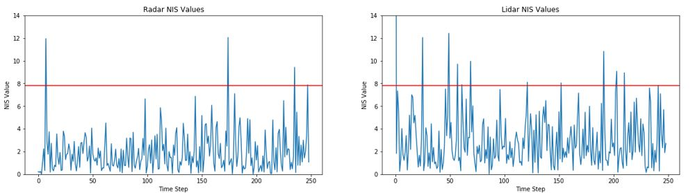
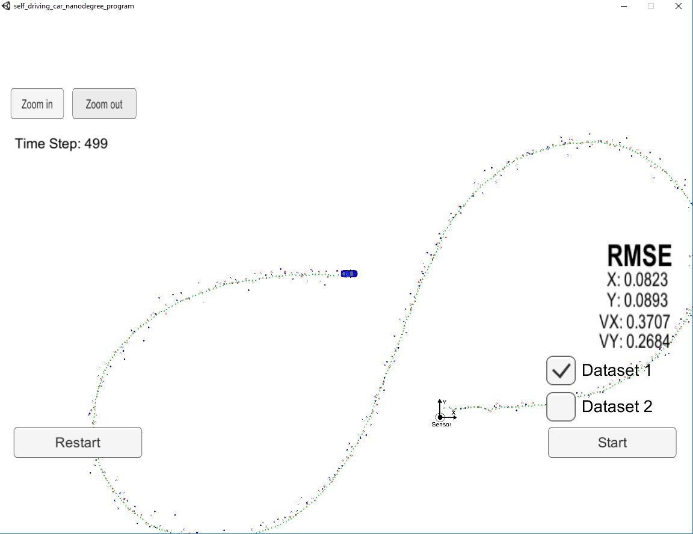

# Unscented Kalman Filter Project 

This project implements an unscented Kalman filter (UKF) using the CTRV motion model to estimate the state of a moving object of interest with noisy lidar and radar measurements. We will be using the same bicycle simulation data set from the extended Kalman filter project. That way we can compare your results with the [EKF project](https://github.com/rakeshch/CarND-Extended-Kalman-Filter).

Remember that all Kalman filters have the same three steps:

Initialization

Prediction

Update

A standard Kalman filter can only handle linear equations. Both the extended Kalman filter and the unscented Kalman filter allow you to use non-linear equations; the difference between EKF and UKF is how they handle non-linear equations. But the basics are the same: initialize, predict, update.

This project involves the Term 2 Simulator which can be downloaded [here](https://github.com/udacity/self-driving-car-sim/releases)

This repository includes two files that can be used to set up and intall [uWebSocketIO](https://github.com/uWebSockets/uWebSockets) for either Linux or Mac systems. For windows you can use either Docker, VMware, or even [Windows 10 Bash on Ubuntu](https://www.howtogeek.com/249966/how-to-install-and-use-the-linux-bash-shell-on-windows-10/) to install uWebSocketIO. 

Once the install for uWebSocketIO is complete, the main program can be built and ran by doing the following from the project top directory.

1. mkdir build
2. cd build
3. cmake ..
4. make
5. ./UnscentedKF

Note that the programs that need to be written to accomplish the project are src/ukf.cpp, src/ukf.h, tools.cpp, and tools.h

Here is the main protocol that main.cpp uses for uWebSocketIO in communicating with the simulator.

INPUT: values provided by the simulator to the c++ program

["sensor_measurement"] => the measurment that the simulator observed (either lidar or radar)

OUTPUT: values provided by the c++ program to the simulator

["estimate_x"] <= kalman filter estimated position x
["estimate_y"] <= kalman filter estimated position y
["rmse_x"]
["rmse_y"]
["rmse_vx"]
["rmse_vy"]

---

## Other Important Dependencies
* cmake >= 3.5
  * All OSes: [click here for installation instructions](https://cmake.org/install/)
* make >= 4.1 (Linux, Mac), 3.81 (Windows)
  * Linux: make is installed by default on most Linux distros
  * Mac: [install Xcode command line tools to get make](https://developer.apple.com/xcode/features/)
  * Windows: [Click here for installation instructions](http://gnuwin32.sourceforge.net/packages/make.htm)
* gcc/g++ >= 5.4
  * Linux: gcc / g++ is installed by default on most Linux distros
  * Mac: same deal as make - [install Xcode command line tools](https://developer.apple.com/xcode/features/)
  * Windows: recommend using [MinGW](http://www.mingw.org/)

## Basic Build Instructions

1. Clone this repo.
2. Make a build directory: `mkdir build && cd build`
3. Compile: `cmake .. && make`
4. Run it: `./UnscentedKF` Previous versions use i/o from text files.  The current state uses i/o
from the simulator.

## Normalized Innovation Squared (NIS)
One of the methods used for checking filter consistency is by using NIS. To calculate NIS, this method first measures the innovation, which is the difference between the estimated positions and the ground truth value. This difference is then normalized by the inverse of the vector S. NIS says that in a 3 dimentional space, approximately 5% of the NIS values should be over 7.8. with a proper implementation of your algorithm. This holds true when looking at the charts for lidar and radar NIS values below:

## RMSE (Root Mean Square Error)
The final values for UKF can be seen from the screen below:

The final RMSE values from EKF are below:
X: 0.0963
Y: 0.0854
VX: 0.4136
VY: 0.4807

The CRTV (Constant Turn Rate and Velocity Magnitude) model used for this project handles velocity much better than the model used for the Extended Kalman Filter as seen from the values above. This model performs better with non-linear functions.

